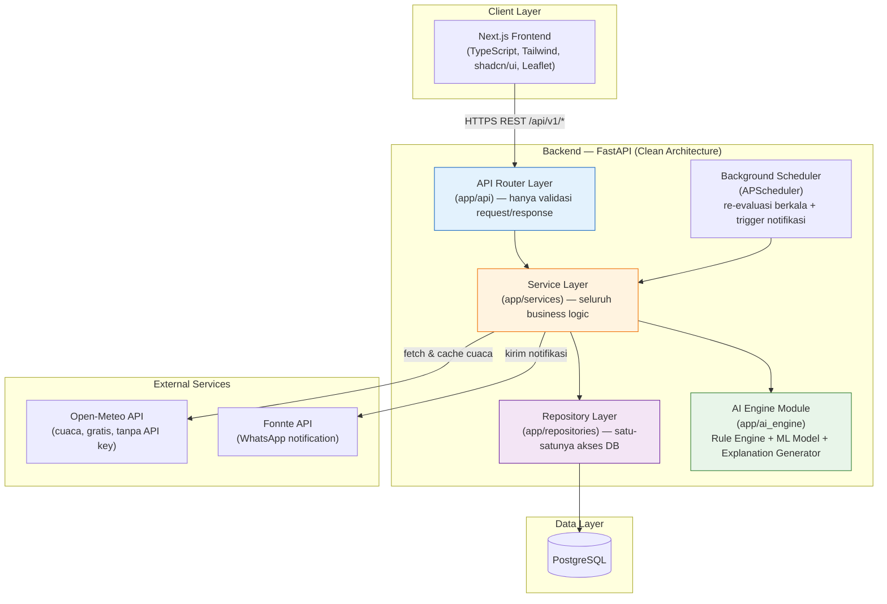
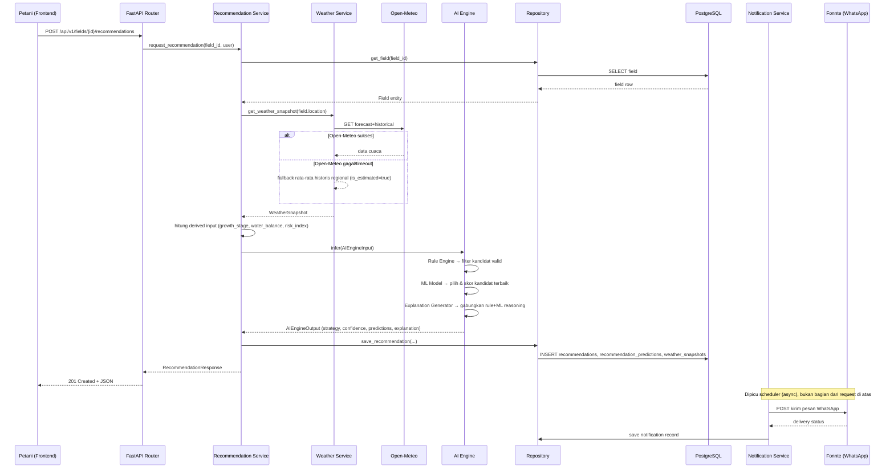
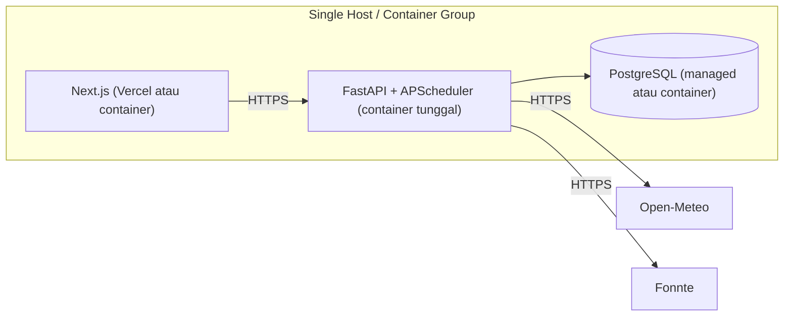

# 02 — System Architecture

## 1. Gaya Arsitektur

AGRIVO dibangun dengan **Clean Architecture** pada backend (pemisahan tegas router → service → repository), dengan **AI Engine sebagai modul internal terpisah** (bukan microservice eksternal). Frontend adalah aplikasi Next.js terpisah yang berkomunikasi dengan backend murni lewat REST API.

### Aturan Ketat Antar Layer

| Layer                               | Boleh melakukan                                                                                                                         | Tidak boleh melakukan                                                                                                                         |
| ----------------------------------- | --------------------------------------------------------------------------------------------------------------------------------------- | --------------------------------------------------------------------------------------------------------------------------------------------- |
| **Router (`app/api`)**              | Validasi schema request (Pydantic), memanggil satu method service, mapping exception service → HTTP status code                         | Query database langsung, logika bisnis apa pun (kalkulasi, keputusan kondisional terkait domain)                                              |
| **Service (`app/services`)**        | Orkestrasi business logic, memanggil repository & AI engine, validasi aturan bisnis (bukan validasi format), transaksi multi-repository | Membentuk SQL/ORM query langsung, mengetahui detail HTTP (status code, header)                                                                |
| **Repository (`app/repositories`)** | Query database (via SQLAlchemy), mapping row ↔ model domain                                                                             | Business logic, validasi aturan bisnis, panggilan ke AI engine atau service eksternal                                                         |
| **AI Engine (`app/ai_engine`)**     | Menerima input terstruktur (dataclass/Pydantic), mengembalikan output terstruktur (rekomendasi + confidence + prediksi + explanation)   | Mengakses database secara langsung, memanggil HTTP eksternal (Open-Meteo/Fonnte) — semua data harus sudah disiapkan service sebelum dipanggil |

## 2. Kenapa AI Engine Menjadi Modul Internal, Bukan Microservice Terpisah

**Keputusan:** AI Engine adalah **modul Python di dalam proses backend yang sama** (`app/ai_engine`), dipanggil langsung oleh service layer sebagai function call — bukan HTTP call ke service terpisah.

**Alasan:**

- Skala hackathon: tim kecil, waktu terbatas. Microservice terpisah menambah kompleksitas operasional (deployment ganda, service discovery, network latency, error handling lintas jaringan) tanpa manfaat nyata di skala ini.
- Model ML yang dipakai (Scikit-learn/XGBoost, model kecil hasil training data sintetis) ringan secara komputasi — tidak butuh resource terisolasi atau scaling independen dari API.
- Tidak ada kebutuhan bahasa pemrograman berbeda antara backend dan AI (keduanya Python).

**Tradeoff yang disadari:**

- Jika model AI menjadi berat (butuh GPU, scaling independen, atau bahasa lain), arsitektur ini akan menjadi bottleneck. **Mitigasi:** modul didesain dengan interface tegas (`AIEngineInput` → `AIEngineOutput`, lihat [07-ai-engine.md](./07-ai-engine.md)) sehingga bisa diekstrak menjadi microservice terpisah di kemudian hari **tanpa mengubah service layer** — service layer hanya bergantung pada interface, bukan implementasi internal.
- Deployment AI Engine dan API selalu berbarengan (tidak bisa update model tanpa deploy ulang API). Untuk hackathon ini dianggap dapat diterima; didokumentasikan sebagai known limitation.

## 3. Kenapa Background Scheduler Dibutuhkan (Bukan di Brief Awal Secara Eksplisit)

Notifikasi WhatsApp membutuhkan _trigger_ proaktif. Karena rekomendasi awalnya bersifat _on-demand_ (dipicu user lewat API), tanpa scheduler tidak ada mekanisme untuk memberi tahu petani ketika kondisi lahannya berubah (misal, cuaca 7 hari ke depan menunjukkan risiko kekeringan yang mengubah rekomendasi optimal).

**Keputusan:** APScheduler berjalan di dalam proses backend yang sama (job in-process untuk hackathon; didokumentasikan sebagai kandidat pertama untuk dipisah ke worker terpisah bila sistem naik skala), menjalankan job harian yang:

1. Mengambil semua `fields` aktif (belum di-soft-delete) yang punya `notification_preferences.enabled = true`.
2. Menjalankan ulang pipeline rekomendasi (fetch cuaca terbaru → AI engine).
3. Membandingkan `recommended_strategy` baru dengan rekomendasi terakhir yang tersimpan.
4. Jika strategi berubah **atau** terdapat risk index cuaca yang melewati ambang kritis, kirim notifikasi WhatsApp via Fonnte dan simpan record di tabel `notifications`.
5. Menerapkan _debounce_: field yang sama tidak dikirim notifikasi lebih dari 1 kali per 24 jam kecuali ada perubahan strategi yang signifikan, untuk mencegah spam.

## 4. Alur Data End-to-End

## 5. Caching Cuaca

Data cuaca dari Open-Meteo di-cache di tabel `weather_snapshots` dengan TTL logis: snapshot dianggap valid selama **maksimum 6 jam** untuk data current/forecast (dikonfigurasi lewat environment variable `WEATHER_CACHE_TTL_HOURS`). Jika request rekomendasi baru datang dalam TTL tersebut untuk field yang sama, service menggunakan snapshot cache alih-alih memanggil Open-Meteo lagi — mengurangi risiko rate limit dan mempercepat response.

## 6. Deployment Topology (Hackathon Scope)

Tidak ada load balancer/multi-instance untuk hackathon. Environment variables mengatur seluruh koneksi eksternal (lihat [08-security-validation.md](./08-security-validation.md) untuk manajemen secrets).

## 7. Kesalahan Umum yang Harus Dihindari

- Jangan memanggil Open-Meteo atau Fonnte langsung dari router atau AI Engine — semua panggilan eksternal harus lewat service layer agar mudah di-mock saat testing.
- Jangan menaruh logika "kapan mengirim notifikasi" di scheduler itu sendiri secara hardcoded — logika keputusan (apa yang dianggap "perubahan signifikan") harus tetap berada di service layer agar konsisten dengan aturan bisnis yang sama dipakai endpoint on-demand.
- Jangan membiarkan AI Engine mengembalikan tipe data bebas (dict sembarangan) — selalu gunakan schema terstruktur (Pydantic/dataclass) sesuai kontrak di [07-ai-engine.md](./07-ai-engine.md), supaya AI Engine benar-benar bisa diganti tanpa mengubah service layer.
