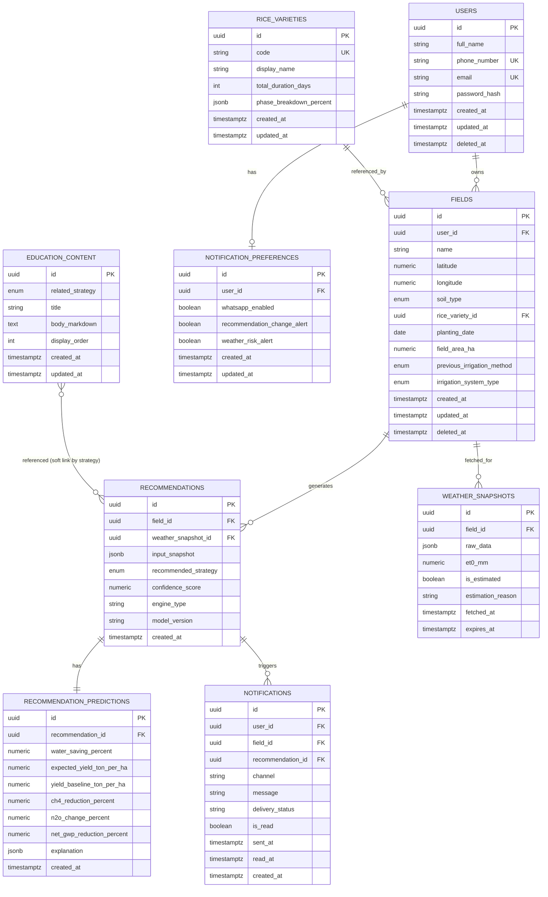

# 05 — Database Design

## 1. Prinsip Desain

- Kolom audit mengikuti spesifikasi rinci setiap tabel: semua tabel memiliki `created_at`; `updated_at` hanya ada pada tabel yang mencantumkannya secara eksplisit (`users`, `notification_preferences`, `rice_varieties`, `fields`, dan `education_content`) dan diperbarui otomatis oleh trigger database.

## 2. Entity Relationship Diagram



## 3. Definisi Tabel

### 3.1 `users`

| Kolom           | Tipe           | Constraint                                     | Catatan                                                                                                                                    |
| --------------- | -------------- | ---------------------------------------------- | ------------------------------------------------------------------------------------------------------------------------------------------ |
| `id`            | `UUID`         | PK, default `gen_random_uuid()`                |                                                                                                                                            |
| `full_name`     | `VARCHAR(150)` | NOT NULL                                       |                                                                                                                                            |
| `phone_number`  | `VARCHAR(20)`  | NOT NULL                                       | Format E.164 (`+62...`); dipakai sebagai login utama & channel OTP WhatsApp; unik di antara user aktif lewat partial unique index di bawah |
| `email`         | `VARCHAR(255)` | NULLABLE                                       | Opsional, untuk profil; unik di antara user aktif bila diisi lewat partial unique index di bawah                                           |
| `password_hash` | `VARCHAR(255)` | NOT NULL                                       | Bcrypt/Argon2, lihat [08-security-validation.md](./08-security-validation.md)                                                              |
| `created_at`    | `TIMESTAMPTZ`  | NOT NULL, default `now()`                      |                                                                                                                                            |
| `updated_at`    | `TIMESTAMPTZ`  | NOT NULL, default `now()`, auto-update trigger |                                                                                                                                            |
| `deleted_at`    | `TIMESTAMPTZ`  | NULLABLE                                       | Soft delete                                                                                                                                |

**Index:** `UNIQUE (phone_number) WHERE deleted_at IS NULL`, `UNIQUE (email) WHERE deleted_at IS NULL AND email IS NOT NULL`.

### 3.2 `notification_preferences`

| Kolom                         | Tipe          | Constraint                        |
| ----------------------------- | ------------- | --------------------------------- |
| `id`                          | `UUID`        | PK                                |
| `user_id`                     | `UUID`        | FK → `users.id`, UNIQUE, NOT NULL |
| `whatsapp_enabled`            | `BOOLEAN`     | NOT NULL, default `true`          |
| `recommendation_change_alert` | `BOOLEAN`     | NOT NULL, default `true`          |
| `weather_risk_alert`          | `BOOLEAN`     | NOT NULL, default `true`          |
| `created_at`, `updated_at`    | `TIMESTAMPTZ` |                                   |

### 3.3 `rice_varieties` (tabel referensi)

| Kolom                     | Tipe           | Constraint                                  | Catatan                                                                                                    |
| ------------------------- | -------------- | ------------------------------------------- | ---------------------------------------------------------------------------------------------------------- |
| `id`                      | `UUID`         | PK                                          |                                                                                                            |
| `code`                    | `VARCHAR(50)`  | UNIQUE, NOT NULL                            | Misal `CIHERANG`, `IR64`                                                                                   |
| `display_name`            | `VARCHAR(100)` | NOT NULL                                    |                                                                                                            |
| `total_duration_days`     | `INTEGER`      | NOT NULL, `CHECK (total_duration_days > 0)` |                                                                                                            |
| `phase_breakdown_percent` | `JSONB`        | NOT NULL                                    | Format: `{"land_preparation": [0,9], "vegetative": [9,45], "reproductive": [45,65], "ripening": [65,100]}` |

Diisi lewat seed migration (lihat §5) berdasarkan tabel di [04-input-specification.md § 1.3](./04-input-specification.md#13-varietas-padi-rice_variety--enum-dapat-diperluas).

### 3.4 `fields`

| Kolom                        | Tipe                                                              | Constraint                                                    | Catatan                                                                                                                                                                                    |
| ---------------------------- | ----------------------------------------------------------------- | ------------------------------------------------------------- | ------------------------------------------------------------------------------------------------------------------------------------------------------------------------------------------ |
| `id`                         | `UUID`                                                            | PK                                                            |                                                                                                                                                                                            |
| `user_id`                    | `UUID`                                                            | FK → `users.id`, NOT NULL                                     |                                                                                                                                                                                            |
| `name`                       | `VARCHAR(100)`                                                    | NOT NULL                                                      | Nama lahan bebas (misal "Sawah Blok A")                                                                                                                                                    |
| `latitude`                   | `NUMERIC(9,6)`                                                    | NOT NULL, `CHECK (latitude BETWEEN -11.00 AND 6.10)`          |                                                                                                                                                                                            |
| `longitude`                  | `NUMERIC(9,6)`                                                    | NOT NULL, `CHECK (longitude BETWEEN 94.70 AND 141.10)`        |                                                                                                                                                                                            |
| `soil_type`                  | `ENUM('SANDY','LOAM','CLAY','SILTY')`                             | NOT NULL                                                      |                                                                                                                                                                                            |
| `rice_variety_id`            | `UUID`                                                            | FK → `rice_varieties.id`, NOT NULL                            |                                                                                                                                                                                            |
| `planting_date`              | `DATE`                                                            | NOT NULL                                                      | Validasi tidak boleh di masa depan dan batas umur maksimum dilakukan di service layer karena `CURRENT_DATE` tidak boleh dipakai dalam PostgreSQL `CHECK` constraint (fungsi non-immutable) |
| `field_area_ha`              | `NUMERIC(6,2)`                                                    | NOT NULL, `CHECK (field_area_ha > 0 AND field_area_ha <= 25)` |                                                                                                                                                                                            |
| `previous_irrigation_method` | `ENUM(...irrigation_strategy...)`                                 | NULLABLE                                                      |                                                                                                                                                                                            |
| `irrigation_system_type`     | `ENUM('TECHNICAL','SEMI_TECHNICAL','RAINFED','COMMUNAL_GRAVITY')` | NULLABLE                                                      |                                                                                                                                                                                            |
| `created_at`, `updated_at`   | `TIMESTAMPTZ`                                                     |                                                               |                                                                                                                                                                                            |
| `deleted_at`                 | `TIMESTAMPTZ`                                                     | NULLABLE                                                      | Soft delete — histori rekomendasi tetap terbaca (read-only), tidak bisa membuat rekomendasi baru                                                                                           |

**Index:**

- `idx_fields_user_id ON fields (user_id) WHERE deleted_at IS NULL` — list lahan milik user.
- `idx_fields_location ON fields (latitude, longitude)` — potensi query spasial sederhana.

### 3.5 `weather_snapshots`

| Kolom               | Tipe           | Constraint                 | Catatan                                               |
| ------------------- | -------------- | -------------------------- | ----------------------------------------------------- |
| `id`                | `UUID`         | PK                         |                                                       |
| `field_id`          | `UUID`         | FK → `fields.id`, NOT NULL |                                                       |
| `raw_data`          | `JSONB`        | NOT NULL                   | Response mentah/relevan dari Open-Meteo atau fallback |
| `et0_mm`            | `NUMERIC(6,2)` | NULLABLE                   | Hasil kalkulasi §04-input-specification §2.2          |
| `is_estimated`      | `BOOLEAN`      | NOT NULL, default `false`  |                                                       |
| `estimation_reason` | `VARCHAR(100)` | NULLABLE                   | Diisi bila `is_estimated = true`                      |
| `fetched_at`        | `TIMESTAMPTZ`  | NOT NULL, default `now()`  |                                                       |
| `expires_at`        | `TIMESTAMPTZ`  | NOT NULL                   | `fetched_at + WEATHER_CACHE_TTL_HOURS`                |

**Index:** `idx_weather_snapshots_field_id_fetched_at ON weather_snapshots (field_id, fetched_at DESC)` — ambil snapshot terbaru per field secara cepat.

### 3.6 `recommendations`

| Kolom                  | Tipe                        | Constraint                                           | Catatan                                                                                                                                                      |
| ---------------------- | --------------------------- | ---------------------------------------------------- | ------------------------------------------------------------------------------------------------------------------------------------------------------------ |
| `id`                   | `UUID`                      | PK                                                   |                                                                                                                                                              |
| `field_id`             | `UUID`                      | FK → `fields.id`, NOT NULL                           |                                                                                                                                                              |
| `weather_snapshot_id`  | `UUID`                      | FK → `weather_snapshots.id`, NOT NULL                |                                                                                                                                                              |
| `input_snapshot`       | `JSONB`                     | NOT NULL                                             | Salinan lengkap seluruh input manual+auto-fetch+derived saat rekomendasi dibuat (point-in-time, immutable)                                                   |
| `recommended_strategy` | `ENUM(irrigation_strategy)` | NOT NULL                                             |                                                                                                                                                              |
| `confidence_score`     | `NUMERIC(4,3)`              | NOT NULL, `CHECK (confidence_score BETWEEN 0 AND 1)` |                                                                                                                                                              |
| `engine_type`          | `VARCHAR(20)`               | NOT NULL                                             | `'hybrid'` untuk MVP (rule+ML); disiapkan untuk kemungkinan `'rule_only'` sebagai fallback jika ML gagal (lihat [07-ai-engine.md](./07-ai-engine.md))        |
| `model_version`        | `VARCHAR(30)`               | NOT NULL                                             | Versi model ML yang dipakai, misal `xgb-v1.0.0`, untuk traceability & evaluasi (lihat [07-ai-engine.md § 7](./07-ai-engine.md#7-model-versioning--evaluasi)) |
| `created_at`           | `TIMESTAMPTZ`               | NOT NULL, default `now()`                            |                                                                                                                                                              |

**Index:** `idx_recommendations_field_id_created_at ON recommendations (field_id, created_at DESC)` — untuk endpoint history (§06-api-specification).

### 3.7 `recommendation_predictions`

| Kolom                       | Tipe           | Constraint                                  | Catatan                                                                                                           |
| --------------------------- | -------------- | ------------------------------------------- | ----------------------------------------------------------------------------------------------------------------- |
| `id`                        | `UUID`         | PK                                          |                                                                                                                   |
| `recommendation_id`         | `UUID`         | FK → `recommendations.id`, UNIQUE, NOT NULL | Relasi 1:1 dengan `recommendations`                                                                               |
| `water_saving_percent`      | `NUMERIC(5,2)` | NOT NULL                                    | Relatif terhadap baseline (§07-ai-engine §6)                                                                      |
| `expected_yield_ton_per_ha` | `NUMERIC(5,2)` | NOT NULL                                    | Estimasi absolut ton/ha (lihat resolusi §07-ai-engine §3)                                                         |
| `yield_baseline_ton_per_ha` | `NUMERIC(5,2)` | NOT NULL                                    | Potensi hasil varietas di bawah Continuous Flooding, untuk transparansi perbandingan                              |
| `ch4_reduction_percent`     | `NUMERIC(5,2)` | NOT NULL                                    |                                                                                                                   |
| `n2o_change_percent`        | `NUMERIC(5,2)` | NOT NULL                                    | Bisa positif (naik) sesuai realita trade-off                                                                      |
| `net_gwp_reduction_percent` | `NUMERIC(5,2)` | NOT NULL                                    | Wajib ada — lihat prinsip produk #4                                                                               |
| `explanation`               | `JSONB`        | NOT NULL                                    | Struktur: `{why, benefits, tradeoffs, how_to_implement, governance_note, rule_constraints_applied, ml_reasoning}` |
| `created_at`                | `TIMESTAMPTZ`  | NOT NULL, default `now()`                   |                                                                                                                   |

### 3.8 `notifications`

| Kolom               | Tipe          | Constraint                          | Catatan                                                   |
| ------------------- | ------------- | ----------------------------------- | --------------------------------------------------------- |
| `id`                | `UUID`        | PK                                  |                                                           |
| `user_id`           | `UUID`        | FK → `users.id`, NOT NULL           |                                                           |
| `field_id`          | `UUID`        | FK → `fields.id`, NOT NULL          |                                                           |
| `recommendation_id` | `UUID`        | FK → `recommendations.id`, NULLABLE | Null untuk notifikasi umum (bukan hasil rekomendasi baru) |
| `channel`           | `VARCHAR(20)` | NOT NULL, default `'whatsapp'`      |                                                           |
| `message`           | `TEXT`        | NOT NULL                            |                                                           |
| `delivery_status`   | `VARCHAR(20)` | NOT NULL, default `'pending'`       | `pending`/`sent`/`failed`                                 |
| `is_read`           | `BOOLEAN`     | NOT NULL, default `false`           |                                                           |
| `sent_at`           | `TIMESTAMPTZ` | NULLABLE                            |                                                           |
| `read_at`           | `TIMESTAMPTZ` | NULLABLE                            |                                                           |
| `created_at`        | `TIMESTAMPTZ` | NOT NULL, default `now()`           |                                                           |

**Index:** `idx_notifications_user_id_created_at ON notifications (user_id, created_at DESC)`.

### 3.9 `education_content`

| Kolom                      | Tipe                        | Constraint            | Catatan                                                 |
| -------------------------- | --------------------------- | --------------------- | ------------------------------------------------------- |
| `id`                       | `UUID`                      | PK                    |                                                         |
| `related_strategy`         | `ENUM(irrigation_strategy)` | NULLABLE              | Null berarti konten umum (bukan spesifik satu strategi) |
| `title`                    | `VARCHAR(200)`              | NOT NULL              |                                                         |
| `body_markdown`            | `TEXT`                      | NOT NULL              |                                                         |
| `display_order`            | `INTEGER`                   | NOT NULL, default `0` |                                                         |
| `created_at`, `updated_at` | `TIMESTAMPTZ`               |                       |                                                         |

Diisi lewat seed script/migration untuk MVP (bukan CMS admin) — lihat [01-project-overview.md § 5](./01-project-overview.md#5-batasan-tegas-non-negotiable-scope) untuk keputusan scope.

### 3.10 `regional_climate_baseline` (tabel referensi fallback cuaca)

| Kolom                   | Tipe           | Constraint       | Catatan |
| ----------------------- | -------------- | ---------------- | ------- |
| `id`                    | `UUID`         | PK               |         |
| `province_code`         | `VARCHAR(10)`  | UNIQUE, NOT NULL |         |
| `avg_daily_rainfall_mm` | `NUMERIC(6,2)` | NOT NULL         |         |
| `avg_temperature_c`     | `NUMERIC(4,1)` | NOT NULL         |         |
| `avg_et0_mm`            | `NUMERIC(5,2)` | NOT NULL         |         |

### 3.11 Dataset Referensi Pengembangan

Migration `0002_seed_reference_data` dan seed script development menggunakan nilai deterministik berikut. Baseline ini hanya fallback development untuk menjalankan aplikasi ketika Open-Meteo tidak tersedia; nilainya harus diganti dengan baseline BMKG tervalidasi per provinsi sebelum produksi.

#### Baseline iklim regional

| `province_code` | `avg_daily_rainfall_mm` | `avg_temperature_c` | `avg_et0_mm` |
| --------------- | ----------------------: | ------------------: | -----------: |
| `ID-JB`         |                    8.50 |                24.5 |         3.80 |
| `ID-JT`         |                    7.20 |                25.0 |         4.10 |
| `ID-JI`         |                    6.80 |                25.5 |         4.20 |
| `ID-SS`         |                    9.10 |                26.0 |         3.90 |
| `ID-SN`         |                    8.00 |                26.5 |         4.30 |

#### Konten edukasi

| `related_strategy`             | `display_order` | `title`                    | `body_markdown`                                                                                                                                                                                 |
| ------------------------------ | --------------: | -------------------------- | ----------------------------------------------------------------------------------------------------------------------------------------------------------------------------------------------- |
| `NULL`                         |               0 | Memilih strategi irigasi   | AGRIVO memberi rekomendasi sesuai kondisi lahan, bukan satu metode untuk semua kondisi. Perhatikan fase tanam, jenis tanah, dan risiko cuaca sebelum menerapkan strategi.                       |
| `CONTINUOUS_FLOODING_MODIFIED` |              10 | Penggenangan termodifikasi | Pertahankan genangan dangkal sekitar 2–5 cm dan izinkan jeda kering singkat bila kondisi lahan memungkinkan. Strategi ini membantu mengurangi penggunaan air tanpa siklus kering-basah penuh.   |
| `AWD_MILD`                     |              20 | AWD ringan                 | Biarkan muka air turun hingga sekitar 15 cm di bawah permukaan tanah sebelum irigasi ulang. Jangan menerapkan AWD pada fase reproduktif dan koordinasikan jadwal bila irigasi dikelola bersama. |
| `DELAYED_IRRIGATION`           |              30 | Irigasi tertunda           | Tunda penggenangan awal setelah tanam untuk membantu perkembangan akar. Terapkan hanya pada fase persiapan lahan dan saat pasokan air dapat dipantau.                                           |
| `PARTIAL_IRRIGATION`           |              40 | Irigasi parsial            | Berikan air dalam volume terbatas atau terjadwal, bukan genangan penuh. Pantau kondisi tanaman dan hentikan strategi bila tanaman menunjukkan tanda kekurangan air.                             |

## 4. Enum Domain PostgreSQL

```sql
CREATE TYPE soil_type AS ENUM ('SANDY', 'LOAM', 'CLAY', 'SILTY');
CREATE TYPE irrigation_strategy AS ENUM (
    'CONTINUOUS_FLOODING',
    'CONTINUOUS_FLOODING_MODIFIED',
    'AWD_MILD',
    'AWD_STRICT',
    'DELAYED_IRRIGATION',
    'PARTIAL_IRRIGATION'
);
CREATE TYPE irrigation_system_type AS ENUM ('TECHNICAL', 'SEMI_TECHNICAL', 'RAINFED', 'COMMUNAL_GRAVITY');
```

## 5. Strategi Migrasi (Alembic)

- Satu migration awal (`0001_initial_schema`) membuat seluruh tabel + enum di atas.
- Migration kedua (`0002_seed_reference_data`) mengisi `rice_varieties`, `regional_climate_baseline`, dan `education_content` menggunakan dataset §3.11 — dijalankan sebagai _data migration_ terpisah dari _schema migration_. Seed script development menggunakan dataset dan operasi idempoten yang sama agar dapat dijalankan ulang secara independen.
- Setiap perubahan skema di kemudian hari **wajib** disertai migration baru (tidak pernah mengedit migration lama yang sudah di-apply ke environment manapun) — konvensi penamaan: `XXXX_deskripsi_singkat_snake_case.py`.
- `alembic revision --autogenerate` dipakai sebagai starting point, tapi **wajib direview manual** sebelum apply, terutama untuk perubahan `ENUM` (Alembic/Postgres tidak selalu auto-generate `ALTER TYPE ... ADD VALUE` dengan benar).

## 6. Kesalahan Umum yang Harus Dihindari

- Jangan meng-hard-delete `fields` atau `users` — selalu soft delete, karena `recommendations` dan `notifications` masih mereferensikan baris tersebut untuk histori.
- Jangan menyimpan hasil kalkulasi `growth_stage` sebagai kolom di `fields` — ini nilai yang berubah setiap hari terhadap tanggal hari ini, harus selalu dihitung ulang di service layer, bukan disimpan sebagai state statis yang bisa basi.
- Jangan lupa index `(field_id, created_at DESC)` pada `recommendations` — endpoint history akan sangat lambat tanpa ini seiring bertambahnya data.
- Jangan mengizinkan `recommendation_predictions` dibuat tanpa `recommendations` yang sudah ada (selalu FK NOT NULL, dan gunakan transaksi database agar kedua insert atomik).
