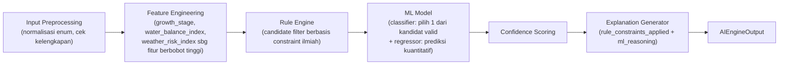

# 07 — AI Engine

> Modul ini adalah nilai jual utama AGRIVO. Baca ini bersama [02-system-architecture.md § 2](./02-system-architecture.md#2-kenapa-ai-engine-menjadi-modul-internal-bukan-microservice-terpisah) untuk konteks arsitektur, dan [04-input-specification.md](./04-input-specification.md) untuk definisi lengkap setiap fitur input.

## 1. Enumerasi Strategi Irigasi

| Kode                                 | Nama                       | Deskripsi Singkat                                                                                                                          |
| ------------------------------------ | -------------------------- | ------------------------------------------------------------------------------------------------------------------------------------------ |
| `CONTINUOUS_FLOODING` (CF)           | Penggenangan terus-menerus | Genangan 5–10cm dipertahankan sepanjang waktu (baseline tradisional)                                                                       |
| `CONTINUOUS_FLOODING_MODIFIED` (CFM) | Genangan termodifikasi     | Genangan dangkal (2–5cm) dengan toleransi kering singkat, lebih hemat dari CF tanpa siklus kering-basah penuh                              |
| `AWD_MILD`                           | AWD ringan/aman            | Muka air dibiarkan turun hingga **15cm di bawah permukaan tanah** sebelum diirigasi ulang (ambang aman, standar IRRI)                      |
| `AWD_STRICT`                         | AWD ketat/agresif          | Muka air dibiarkan turun hingga **≥30cm di bawah permukaan tanah** sebelum diirigasi ulang — penghematan air maksimal, risiko lebih tinggi |
| `DELAYED_IRRIGATION`                 | Irigasi tertunda           | Penundaan genangan awal setelah tanam/pindah tanam untuk mendorong perakaran lebih dalam sebelum digenangi                                 |
| `PARTIAL_IRRIGATION`                 | Irigasi parsial            | Pemberian air dalam volume terbatas/terjadwal, bukan genangan penuh maupun siklus kering-basah total                                       |

## 2. Resolusi Desain: Rule Engine vs ML

Brief awal meminta AI "terasa dapat dipercaya, bukan lookup table berbungkus ML" sekaligus meminta model ML dilatih dari data sintetis berbasis literatur — dua permintaan yang secara naif bisa saling kontradiktif (jika data latih dibuat dari rule yang sama, ML hanya meniru rule secara fuzzy). AGRIVO menyelesaikan ini dengan **pembagian peran yang eksplisit dan tidak tumpang tindih**:

| Layer                     | Peran                                                                                                                                                                                                                                                                                                                           | Sifat                                                                                                   |
| ------------------------- | ------------------------------------------------------------------------------------------------------------------------------------------------------------------------------------------------------------------------------------------------------------------------------------------------------------------------------- | ------------------------------------------------------------------------------------------------------- |
| **Rule Engine**           | **Scientific constraint & candidate filter** — menyaring strategi yang **secara ilmiah tidak valid/berisiko** untuk kombinasi kondisi tertentu (misal AWD ketat saat fase reproduktif). Menghasilkan **himpunan kandidat valid**, bukan satu jawaban final.                                                                     | Deterministik, berbasis ambang riset yang didokumentasikan sumbernya (§4), mudah diaudit manusia non-ML |
| **ML Model**              | **Keputusan final** — memilih satu strategi terbaik **di antara kandidat yang sudah lolos filter rule engine**, berdasarkan pola kuantitatif dari data sintetis (interaksi non-linear antar fitur seperti `water_balance_index`, `soil_type`, `growth_stage`), plus memprediksi angka kuantitatif (water saving %, yield, GWP). | Probabilistik, memberi `confidence_score`, bisa di-retrain dengan data riil tanpa mengubah rule engine  |
| **Explanation Generator** | Menyusun narasi yang menjelaskan **kedua lapisan**: constraint apa yang menyingkirkan kandidat lain (`rule_constraints_applied`), dan kenapa ML memilih kandidat ini di antara yang tersisa (`ml_reasoning`, termasuk feature importance)                                                                                       | Deterministik, template berbasis hasil kedua layer di atas                                              |

**Kenapa ini menjawab kontradiksi:** Rule engine **tidak pernah menjadi otoritas keputusan akhir** — ia hanya menghapus opsi yang secara ilmiah tidak masuk akal (safety net), sehingga sistem tidak bisa "terjebak" merekomendasikan sesuatu yang berbahaya murni karena kebetulan statistik data sintetis. ML **tidak pernah bekerja tanpa batasan** — ia hanya memutuskan di antara opsi yang sudah dijamin valid, sehingga keputusannya selalu bisa dijelaskan sebagai "pola yang dipelajari, bukan template kaku", karena kandidat yang tersisa untuk dipilih ML seringkali lebih dari satu (lihat Decision Matrix §8) dan ML benar-benar mempertimbangkan gradasi fitur (misal seberapa jauh water balance dari ambang) untuk memutuskan — bukan sekadar mapping 1:1 ke jawaban rule.

## 3. Pipeline AI Engine



### Interface Modul (Kontrak, Tidak Boleh Diubah Tanpa Update Dokumen Ini)

```python
# app/ai_engine/schemas.py

class AIEngineInput(BaseModel):
    soil_type: SoilType
    growth_stage: GrowthStage
    water_balance_index: WaterBalanceIndex       # SURPLUS | NORMAL | DEFICIT
    weather_risk_index: WeatherRiskIndex         # DROUGHT_HIGH | DROUGHT_MODERATE | NORMAL | EXCESS_HIGH
    irrigation_system_type: Optional[IrrigationSystemType]
    rice_variety_code: str
    is_weather_estimated: bool                   # true jika fallback Open-Meteo aktif
    previous_irrigation_method: Optional[IrrigationStrategy]

class AIEngineOutput(BaseModel):
    recommended_strategy: IrrigationStrategy
    confidence_score: float                      # 0.0 - 1.0
    engine_type: Literal["hybrid", "rule_only"]
    model_version: str
    predictions: PredictionResult
    explanation: ExplanationResult
```

Service layer **hanya** memanggil `ai_engine.infer(input: AIEngineInput) -> AIEngineOutput`. Implementasi internal (algoritma rule, jenis model ML) boleh berubah kapan pun tanpa mengubah service layer, selama kontrak ini dipatuhi.

## 4. Rule Engine — Constraint Ilmiah Terdokumentasi

### 4.1 Validitas Dasar per Fase Pertumbuhan (Layer 1)

| Strategi                       | LAND_PREPARATION | VEGETATIVE | REPRODUCTIVE | RIPENING |
| ------------------------------ | :--------------: | :--------: | :----------: | :------: |
| `CONTINUOUS_FLOODING`          |        ✅        |     ✅     |      ✅      |    ❌    |
| `CONTINUOUS_FLOODING_MODIFIED` |        ✅        |     ✅     |      ✅      |    ✅    |
| `AWD_MILD`                     |        ❌        |     ✅     |      ❌      |    ✅    |
| `AWD_STRICT`                   |        ❌        |     ✅     |      ❌      |    ✅    |
| `DELAYED_IRRIGATION`           |        ✅        |     ❌     |      ❌      |    ❌    |
| `PARTIAL_IRRIGATION`           |        ❌        |     ✅     |      ❌      |    ✅    |

**Sumber ilmiah ringkas:** Fase reproduktif (inisiasi malai–pembungaan) adalah periode paling sensitif terhadap defisit air pada padi — penelitian irigasi padi (IRRI, literatur AWD) konsisten menyarankan mempertahankan genangan stabil pada window ini, apa pun jenis tanah/cuacanya. Fase pematangan (ripening) sebaliknya toleran kekeringan dan justru dianjurkan mulai dikeringkan 10–14 hari sebelum panen untuk memudahkan panen & menurunkan emisi metana tanpa risiko hasil.

### 4.2 Constraint Tambahan Berbasis Jenis Tanah, Cuaca, dan Sistem Irigasi (Layer 2)

| Kode   | Aturan (IF)                                                                                                          | Efek (THEN)                                              | Alasan Ilmiah                                                                                                                                                                                                                                                                                                                                                                                                                                                                                                           |
| ------ | -------------------------------------------------------------------------------------------------------------------- | -------------------------------------------------------- | ----------------------------------------------------------------------------------------------------------------------------------------------------------------------------------------------------------------------------------------------------------------------------------------------------------------------------------------------------------------------------------------------------------------------------------------------------------------------------------------------------------------------- |
| **R5** | `soil_type == SANDY`                                                                                                 | Kecualikan `AWD_STRICT` (semua fase)                     | Perkolasi cepat pada tanah berpasir membuat penurunan muka air sulit diprediksi/dikendalikan; ambang -30cm berisiko melewati batas toleransi tanaman sebelum sempat diirigasi ulang, dengan manfaat penghematan tambahan yang minim dibanding AWD mild                                                                                                                                                                                                                                                                  |
| **R6** | `soil_type == CLAY` **AND** `water_balance_index == SURPLUS`                                                         | Kecualikan `AWD_STRICT`                                  | Tanah liat dengan surplus air (muka air dangkal alami) sudah memiliki retensi tinggi — pengeringan agresif tidak memberi manfaat proporsional dan berisiko retak tanah yang merusak struktur akar. **Catatan:** exclusion ini terikat pada kondisi `water_balance_index`, bukan `soil_type` semata — tanah liat dalam kondisi **defisit** tetap bisa menjadi kandidat AWD_STRICT (lihat Skenario #15 di §8), karena constraint yang benar berdasar riset adalah kondisi muka air aktual, bukan generalisasi jenis tanah |
| **R7** | `weather_risk_index == DROUGHT_HIGH` **AND** `irrigation_system_type IN (RAINFED, SEMI_TECHNICAL, COMMUNAL_GRAVITY)` | Kecualikan `CONTINUOUS_FLOODING` dan `AWD_STRICT`        | Tanpa jaminan sumber air teknis, mempertahankan genangan penuh saat drought tinggi tidak realistis/wasteful; AWD ketat berisiko tidak bisa diirigasi ulang tepat waktu saat kekeringan parah tanpa kontrol air andal                                                                                                                                                                                                                                                                                                    |
| **R8** | `weather_risk_index == EXCESS_HIGH`                                                                                  | Kecualikan `DELAYED_IRRIGATION` dan `PARTIAL_IRRIGATION` | Saat curah hujan berlebih, strategi yang berfokus pada pengurangan pemberian air tidak relevan — fokus seharusnya pada kapasitas drainase, yang lebih dekat ke CFM/AWD                                                                                                                                                                                                                                                                                                                                                  |
| **R9** | `irrigation_system_type == RAINFED`                                                                                  | Kecualikan `AWD_STRICT` (semua kondisi lain)             | Tanpa sumber irigasi buatan sama sekali, tidak ada jaminan re-flooding tepat waktu setelah pengeringan agresif — risiko gagal panen terlalu tinggi untuk direkomendasikan sistem                                                                                                                                                                                                                                                                                                                                        |

Jika hasil filter Layer 1 + Layer 2 menyisakan **himpunan kosong** (kasus tepi ekstrem), sistem fallback ke `CONTINUOUS_FLOODING_MODIFIED` sebagai strategi paling aman secara default, dengan `engine_type = "rule_only"` dan `confidence_score` diturunkan (lihat §5).

## 5. Confidence Scoring

`confidence_score` = probabilitas softmax ML model untuk kandidat yang dipilih, **dengan masking**: hanya kandidat hasil rule engine yang ikut dinormalisasi (kandidat yang di-exclude rule engine diberi probabilitas 0 sebelum softmax, sehingga tidak pernah terpilih meski skor mentahnya tinggi).

Penyesuaian tambahan:

- Jika `is_weather_estimated == true` (fallback Open-Meteo aktif), `confidence_score` dikalikan faktor **0.85** — data cuaca estimasi menurunkan keyakinan prediksi.
- Jika sistem jatuh ke `engine_type = "rule_only"` (ML gagal dipanggil, misal exception/timeout), `confidence_score` diset tetap **0.5** dan strategi diambil dari kandidat rule engine pertama sesuai urutan prioritas statis (CFM > AWD_MILD > CF > PARTIAL > DELAYED > AWD_STRICT), bukan dari ML — memastikan sistem tetap merespons meski ML down (graceful degradation), dicatat jelas di `explanation.why` bahwa ini mode fallback.

## 6. Baseline Pembanding Water Saving

`water_saving_percent` dihitung relatif terhadap **Continuous Flooding (CF)** sebagai baseline default, kecuali user mengisi `previous_irrigation_method` secara eksplisit — dalam hal ini baseline memakai metode yang diisi user, memberi perbandingan yang lebih personal ("dibanding cara Anda sebelumnya", bukan generik).

## 7. Expected Yield sebagai Nilai Absolut (ton/ha)

**Keputusan (mengganti pendekatan persentase-saja):** `expected_yield_ton_per_ha` dilaporkan sebagai **estimasi absolut**, dihitung dari:

$$\text{expected\_yield} = Y_{base}(\text{rice\_variety}) \times (1 + \frac{\Delta_{yield}(\text{strategy})}{100}) \times F_{fertility}$$

Dengan:

- $Y_{base}$ = potensi hasil varietas di bawah pengelolaan standar & Continuous Flooding (tabel §7.1), dari data potensi hasil varietas yang dirilis Balitbangtan/deskripsi varietas.
- $\Delta_{yield}(\text{strategy})$ = persentase perubahan hasil relatif terhadap CF per strategi, dari meta-analisis literatur AWD/irigasi (tabel §7.2).
- $F_{fertility}$ = faktor kesuburan lahan, **default `1.0`** (asumsi pengelolaan rata-rata/standar).

### 7.1 Potensi Hasil Baseline per Varietas (Continuous Flooding, ton/ha)

| Varietas              | $Y_{base}$ (ton/ha) |
| --------------------- | ------------------- |
| Ciherang              | 6.0                 |
| IR64                  | 5.5                 |
| Inpari 32             | 6.5                 |
| Inpari 42 Agritan GSR | 6.2                 |
| Mekongga              | 6.8                 |

### 7.2 Faktor Penyesuaian Hasil per Strategi ($\Delta_{yield}$, %)

| Strategi                       | $\Delta_{yield}$ | Catatan literatur                                                                       |
| ------------------------------ | ---------------- | --------------------------------------------------------------------------------------- |
| `CONTINUOUS_FLOODING`          | 0%               | Baseline                                                                                |
| `CONTINUOUS_FLOODING_MODIFIED` | 0%               | Umumnya netral, tidak ada tekanan air signifikan                                        |
| `AWD_MILD`                     | +1%              | Sering netral-positif (aerasi akar lebih baik) bila diterapkan tepat waktu              |
| `AWD_STRICT`                   | −2%              | Risiko penurunan bila timing re-irigasi meleset, meski penghematan air jauh lebih besar |
| `DELAYED_IRRIGATION`           | −1%              | Penundaan sedikit menekan pertumbuhan awal                                              |
| `PARTIAL_IRRIGATION`           | −4%              | Volume air terbatas menekan hasil lebih nyata dibanding AWD                             |

### 7.3 Asumsi & Keterbatasan (WAJIB Ditampilkan ke User)

Estimasi `expected_yield_ton_per_ha` **mengasumsikan**:

1. Pengelolaan pemupukan, pengendalian hama/penyakit, dan kesuburan tanah berada pada **kondisi rata-rata/standar** ($F_{fertility} = 1.0$) — AGRIVO **tidak** memodelkan input pupuk, serangan hama, atau riwayat kesuburan spesifik lahan karena data tersebut tidak dikumpulkan sistem (lihat [04-input-specification.md](./04-input-specification.md)).
2. Strategi diterapkan **dengan timing yang benar** sesuai `how_to_implement` di explanation — keterlambatan re-irigasi pada AWD/Partial dapat menurunkan hasil lebih jauh dari estimasi.
3. Angka ini adalah **estimasi berbasis literatur**, bukan prediksi presisi tinggi — response API dan UI **wajib** menampilkan label "estimasi" beserta `yield_baseline_ton_per_ha` sebagai pembanding, agar user tidak menganggapnya sebagai jaminan hasil panen.

## 8. Decision Matrix (20+ Skenario Representatif)

Tabel berikut adalah bukti eksplisit bahwa sistem **method-agnostic** — kombinasi berbeda menghasilkan strategi berbeda, termasuk beberapa kasus **AWD sengaja TIDAK direkomendasikan** meski secara naif dianggap selalu ideal (ditandai 🚫AWD). `Kandidat Valid` adalah hasil setelah Rule Engine (Layer 1 + Layer 2); `Rekomendasi Final` adalah hasil pilihan ML di antara kandidat tersebut.

| #   | Jenis Tanah | Fase Tanam   | Water Balance | Risk Cuaca       | Sistem Irigasi   | Kandidat Valid (Rule Engine)           | Rekomendasi Final (ML)                  | Alasan Singkat                                                                                                                                                          |
| --- | ----------- | ------------ | ------------- | ---------------- | ---------------- | -------------------------------------- | --------------------------------------- | ----------------------------------------------------------------------------------------------------------------------------------------------------------------------- |
| 1   | Sandy       | Land Prep    | Deficit       | Normal           | Technical        | CF, CFM, Delayed                       | **Delayed Irrigation**                  | Tanah pasir + defisit air → tunda genangan untuk perkuat perakaran dulu; sistem teknis menjamin ketepatan waktu re-irigasi                                              |
| 2   | Sandy       | Vegetative   | Deficit       | Drought High     | Rainfed          | CFM, AWD_Mild, Partial                 | **Partial Irrigation** 🚫AWD-preferensi | Air sangat terbatas & tadah hujan; kontrol volume parsial lebih aman dari siklus kering total di tanah berdrainase cepat                                                |
| 3   | Loam        | Vegetative   | Normal        | Normal           | Technical        | CF, CFM, AWD_Mild, AWD_Strict, Partial | **AWD Mild**                            | Kondisi ideal tekstual — loam seimbang, cuaca normal, sistem teknis mendukung; AWD mild adalah pilihan terbukti paling efisien                                          |
| 4   | Clay        | Vegetative   | Surplus       | Normal           | Communal Gravity | CF, CFM, AWD_Mild, Partial             | **CFM** 🚫AWD                           | Retensi air tanah liat sudah tinggi (surplus alami) — AWD tidak memberi manfaat tambahan signifikan; CFM cukup tanpa perlu koordinasi ketat di sistem gravitasi bersama |
| 5   | Clay        | Reproductive | Surplus       | Normal           | Communal Gravity | CF, CFM                                | **CFM** 🚫AWD                           | Fase reproduktif sensitif air → AWD terkunci di Layer 1; tanah liat retensi tinggi mendukung CFM tanpa risiko                                                           |
| 6   | Silty       | Reproductive | Normal        | Excess High      | Semi-Technical   | CF, CFM                                | **CFM** 🚫AWD                           | Fase kritis + hujan berlebih → fokus kapasitas drainase kecil, bukan pengurangan air                                                                                    |
| 7   | Sandy       | Reproductive | Deficit       | Drought Moderate | Technical        | CF, CFM                                | **Continuous Flooding** 🚫AWD           | Fase reproduktif wajib genangan stabil meski tanah pasir; sistem teknis menjamin pasokan demi keamanan hasil                                                            |
| 8   | Loam        | Ripening     | Deficit       | Normal           | Technical        | CFM, AWD_Mild, AWD_Strict, Partial     | **AWD Strict**                          | Fase pematangan toleran kering, tanah loam mendukung penghematan maksimal tanpa risiko berarti                                                                          |
| 9   | Clay        | Ripening     | Surplus       | Normal           | Technical        | CFM, AWD_Mild, Partial                 | **Partial Irrigation** 🚫AWD            | Menjelang panen, kontrol volume bertahap lebih aman dari risiko retak tanah liat akibat AWD ketat                                                                       |
| 10  | Sandy       | Ripening     | Deficit       | Drought High     | Rainfed          | CFM, AWD_Mild, Partial                 | **AWD Mild**                            | Fase matang toleran kering + drought tinggi mendukung pengeringan lebih awal; mild cukup tanpa risiko ekstrem strict di tanah pasir                                     |
| 11  | Loam        | Land Prep    | Normal        | Normal           | Technical        | CF, CFM, Delayed                       | **Continuous Flooding**                 | Kondisi normal, olah tanah standar butuh genangan penuh untuk pelumpuran optimal                                                                                        |
| 12  | Clay        | Land Prep    | Surplus       | Excess High      | Communal Gravity | CF, CFM                                | **CFM**                                 | Hujan berlebih + tanah liat → CFM beri ruang drainase kecil, cegah genangan berlebihan merusak bibit                                                                    |
| 13  | Sandy       | Land Prep    | Deficit       | Drought High     | Rainfed          | CFM, Delayed                           | **Delayed Irrigation**                  | Air sangat terbatas tadah hujan; tunda irigasi awal mengurangi kebutuhan air saat pasokan tak pasti                                                                     |
| 14  | Loam        | Vegetative   | Deficit       | Drought Moderate | Semi-Technical   | CF, CFM, AWD_Mild, AWD_Strict, Partial | **AWD Mild**                            | Defisit ringan-sedang, semi-teknis cukup mendukung siklus aman; mild lebih sesuai dari strict mengingat kontrol air terbatas                                            |
| 15  | Clay        | Vegetative   | Deficit       | Drought High     | Technical        | CF, CFM, AWD_Mild, AWD_Strict, Partial | **AWD Strict**                          | Tanah liat namun kondisi **defisit** (bukan surplus) + sistem teknis menjamin re-irigasi tepat waktu → penghematan maksimal aman diterapkan (lihat catatan R6 di §4.2)  |
| 16  | Sandy       | Vegetative   | Surplus       | Excess High      | Technical        | CF, CFM, AWD_Mild                      | **AWD Mild**                            | Drainase alami cepat tanah pasir menurunkan risiko kelebihan air; AWD mild manfaatkan jeda hujan untuk aerasi akar                                                      |
| 17  | Silty       | Vegetative   | Normal        | Normal           | Rainfed          | CF, CFM, AWD_Mild, Partial             | **AWD Mild**                            | Kondisi normal namun tadah hujan tanpa kontrol air penuh → mild memberi penghematan wajar dengan margin aman                                                            |
| 18  | Silty       | Ripening     | Surplus       | Normal           | Rainfed          | CFM, AWD_Mild, Partial                 | **Partial Irrigation** 🚫AWD            | Menjelang panen, tadah hujan dengan surplus alami; partial cukup percepat pengeringan tanpa bergantung kontrol irigasi yang tak tersedia                                |
| 19  | Loam        | Reproductive | Deficit       | Drought High     | Technical        | CF, CFM                                | **Continuous Flooding** 🚫AWD           | Fase kritis + drought tinggi; sistem teknis menjamin pasokan — genangan penuh wajib dipertahankan demi cegah gagal panen                                                |
| 20  | Clay        | Land Prep    | Deficit       | Normal           | Semi-Technical   | CF, CFM, Delayed                       | **Continuous Flooding**                 | Defisit air pada tanah liat tetap butuh genangan penuh untuk saturasi & pelumpuran efektif                                                                              |
| 21  | Sandy       | Ripening     | Normal        | Normal           | Technical        | CFM, AWD_Mild, Partial                 | **Partial Irrigation** 🚫AWD            | Tanah pasir boros air meski fase matang; partial beri kontrol presisi tanpa siklus kering total yang percuma di tanah berdrainase cepat                                 |
| 22  | Loam        | Vegetative   | Surplus       | Excess High      | Communal Gravity | CF, CFM, AWD_Mild, AWD_Strict          | **AWD Mild**                            | Kelebihan air hujan pada tanah loam; mild beri drainase terkendali + governance note wajib karena sistem gravitasi bersama                                              |

**Catatan penting dari matriks di atas:**

- Baris #4, #5, #6, #7, #9, #18, #19, #21 secara eksplisit menunjukkan AWD (mild maupun strict) **tidak** menjadi rekomendasi akhir meski secara naif dianggap "selalu terbaik untuk hemat air" — konsisten dengan prinsip produk #2 (method-agnostic).
- Baris #6, #12, #22 dengan `Communal Gravity` **wajib** menyertakan `governance_note` di explanation (lihat §9), tanpa mengecualikan strategi tersebut dari daftar kandidat — governance adalah anotasi, bukan filter.
- Baris #15 vs #4/#5 menunjukkan bahwa constraint terhadap tanah liat **bergantung pada kondisi water balance aktual**, bukan generalisasi kaku "tanah liat = tidak butuh AWD" — sesuai temuan riset di [01-project-overview.md § 2.2](./01-project-overview.md#22-tidak-ada-satu-metode-yang-cocok-untuk-semua-kondisi).

## 9. Explanation Generator

Struktur `explanation` (disimpan di `recommendation_predictions.explanation`, lihat [05-database-design.md § 3.7](./05-database-design.md#37-recommendation_predictions)):

```json
{
  "why": "Ringkasan satu-dua kalimat kondisi lahan & alasan utama.",
  "benefits": ["daftar manfaat kuantitatif/kualitatif"],
  "tradeoffs": ["daftar trade-off, termasuk kenaikan N2O bila relevan"],
  "how_to_implement": "Instruksi praktis, bahasa sederhana untuk petani.",
  "governance_note": "Diisi HANYA bila irrigation_system_type == COMMUNAL_GRAVITY atau SEMI_TECHNICAL, menjelaskan kebutuhan koordinasi.",
  "rule_constraints_applied": [
    "Daftar kandidat yang dikecualikan rule engine beserta alasan singkat"
  ],
  "ml_reasoning": {
    "chosen_candidate": "kode strategi terpilih",
    "candidates_considered": ["daftar kandidat valid yang dipertimbangkan ML"],
    "top_features": [{ "feature": "nama_fitur", "influence": 0.0 }]
  }
}
```

`top_features` diambil dari `feature_importances_` model XGBoost (global) dikombinasikan dengan kontribusi fitur spesifik prediksi ini (didekati lewat perbandingan skor kandidat dengan/tanpa fitur tersebut — pendekatan sederhana, bukan SHAP penuh, cukup untuk transparansi tingkat hackathon dan didokumentasikan sebagai simplifikasi).

## 10. Net GWP — Faktor Emisi Eksplisit

Menggunakan **GWP100 dari IPCC AR6**: CH4 (non-fosil, pertanian) = **27**, N2O = **273** (kg CO2-eq per kg gas).

Asumsi kontribusi baseline (Continuous Flooding) berbasis literatur emisi sawah tergenang: CH4 berkontribusi **~90%** dari total GWP emisi tanah sawah, N2O **~10%** (kondisi anaerobik terus-menerus menekan N2O tapi memicu CH4 tinggi).

**Formula:**

$$\text{Net GWP}_{strategy} = (CH4_{baseline} \times (1 - \frac{r_{ch4}}{100}) \times 27) + (N2O_{baseline} \times (1 + \frac{r_{n2o}}{100}) \times 273)$$

$$\text{net\_gwp\_reduction\_percent} = \frac{\text{Net GWP}_{baseline} - \text{Net GWP}_{strategy}}{\text{Net GWP}_{baseline}} \times 100$$

Dengan $r_{ch4}$ = `ch4_reduction_percent` dan $r_{n2o}$ = `n2o_change_percent` (bisa positif/naik) dari output model.

**Contoh konkret (Skenario #3, AWD Mild):** Jika baseline CH4=100 unit, N2O=11.1 unit (rasio 90:10 dari total GWP 2700+3030≈... —lihat implementasi kalkulator di kode untuk presisi), `ch4_reduction_percent=35%`, `n2o_change_percent=+8%` → Net GWP turun signifikan karena penurunan CH4 (bobot GWP tinggi ×27 tapi volume besar) melebihi kenaikan N2O (bobot ×273 tapi volume kecil), menghasilkan `net_gwp_reduction_percent ≈ 27%` — **inilah angka yang wajib ditampilkan**, bukan `ch4_reduction_percent` semata.

## 11. Model Versioning & Evaluasi

- **Versioning:** `model_version` mengikuti semver (`xgb-v1.0.0`). Setiap retraining (data baru/hyperparameter berubah) menaikkan versi, disimpan sebagai artefak file (`.joblib`) dengan nama mengandung versi, dan dicatat di `recommendations.model_version` untuk traceability penuh (bisa telusur rekomendasi mana pakai model versi berapa).
- **Evaluasi:** dataset sintetis dipecah train/test (80/20), diukur akurasi klasifikasi kandidat-terpilih serta MAE untuk regressor kuantitatif (water saving %, yield, GWP). Ditambah **test set skenario manual** (§8 di atas) sebagai _regression test_ wajib lolos sebelum model baru di-deploy — memastikan retraining tidak menghasilkan model yang melanggar constraint ilmiah (misal tiba-tiba merekomendasikan AWD strict di fase reproduktif — yang seharusnya mustahil karena rule engine, tapi dites juga di level integrasi).
- **Explainability ke user:** UI menampilkan `top_features` dalam bahasa sederhana ("Jenis tanah dan kondisi kekeringan tanah paling memengaruhi rekomendasi ini"), bukan angka teknis mentah, lihat [10-ui-ux-guidelines.md](./10-ui-ux-guidelines.md).

## 12. Roadmap Upgrade Pasca-Hackathon

1. Kumpulkan data riil dari pilot lapangan (kerja sama penyuluh/kelompok tani) — hasil aktual water saving, yield, dan pengukuran emisi bila memungkinkan.
2. Retrain model dengan campuran data sintetis + riil, evaluasi ulang dengan skema §11.
3. Rule engine tetap dipertahankan sebagai safety layer permanen (tidak dihapus), meski ambangnya bisa disesuaikan seiring data riil membuktikan angka literatur perlu dikalibrasi ulang untuk konteks Indonesia spesifik.

## 13. Kesalahan Umum yang Harus Dihindari

- Jangan membiarkan ML memilih kandidat yang sudah di-exclude rule engine — wajib masking probabilitas sebelum argmax/softmax, bukan sekadar "biasanya tidak akan dipilih".
- Jangan melaporkan `ch4_reduction_percent` di UI tanpa `net_gwp_reduction_percent` di sampingnya.
- Jangan membuat dataset sintetis training dengan bias implisit condong ke AWD (misal proporsi skenario yang tidak seimbang) — dataset generator wajib divalidasi terhadap tabel §8 agar keluaran final tidak didominasi satu strategi.
- Jangan melaporkan `expected_yield_ton_per_ha` tanpa `yield_baseline_ton_per_ha` dan catatan asumsi §7.3 — angka absolut tanpa konteks pembanding berisiko disalahartikan sebagai jaminan.
